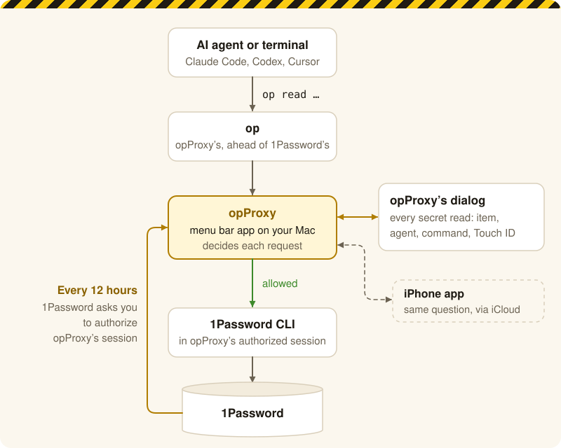
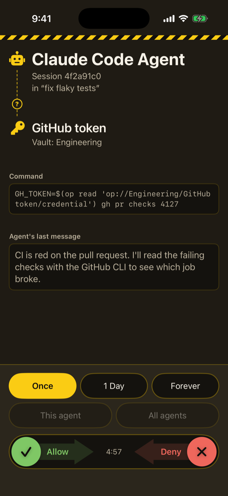
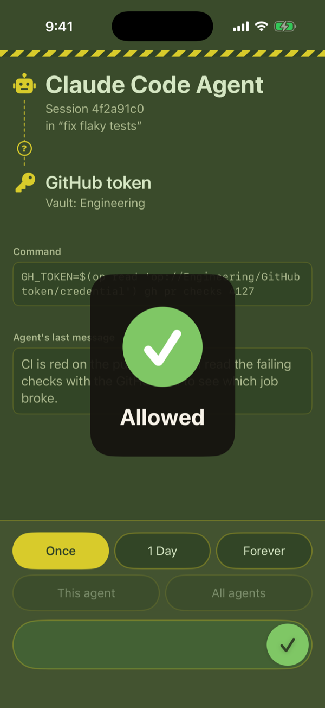
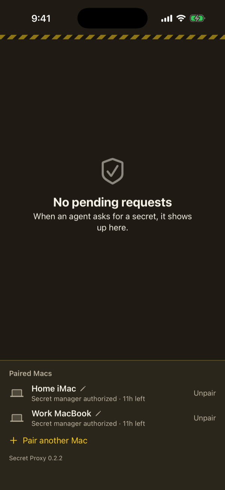
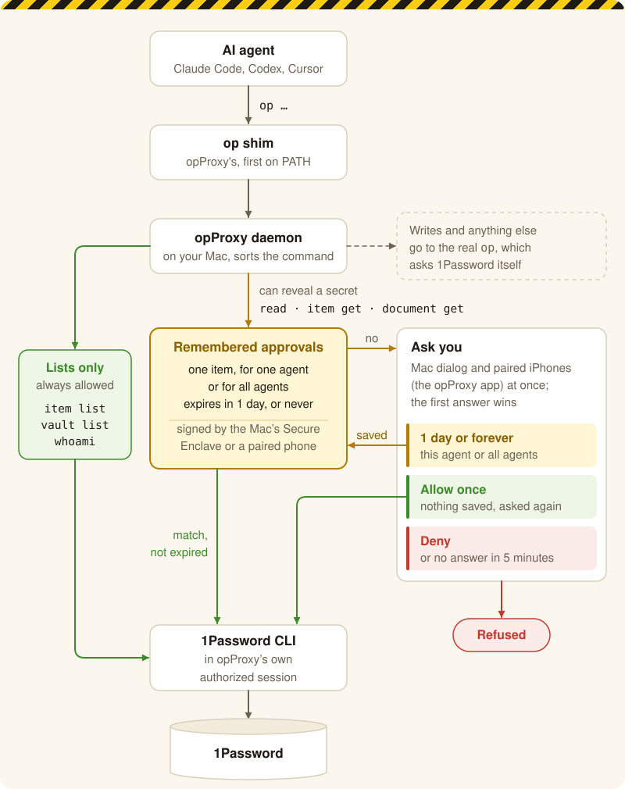
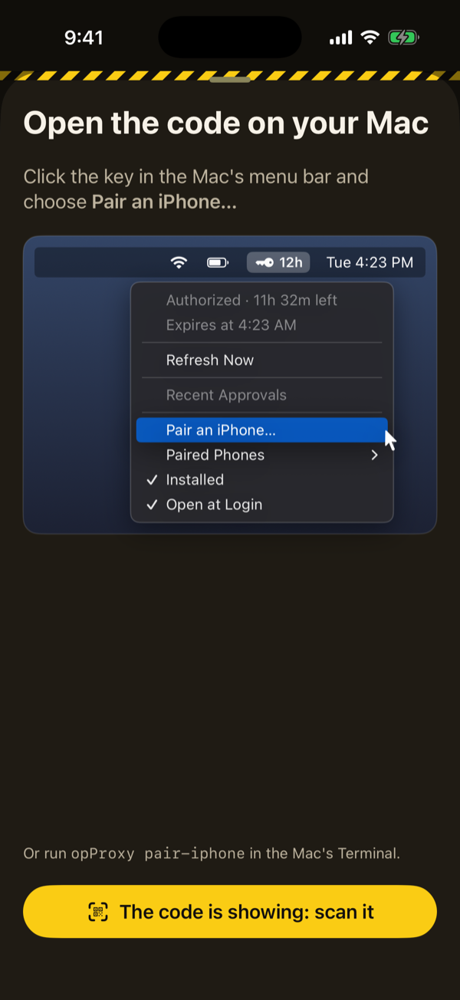

# opProxy

A drop-in `op` CLI tool that puts one approval dialog in front of 1Password CLI reads from AI agents and terminals. When an agent asks for a secret, a dialog shows you the item, who is asking and why, and you answer there or on a paired iPhone running opProxy's iPhone app. Allow it just this once, so you're asked every time, or let that agent, or every agent, read that item for a day or for good.

> [!WARNING]
> **opProxy lets listings through without asking.** Commands like `item list` and `vault list` return no secrets, so they always run. They do reveal your vaults' metadata to anything that can run `op`, whether an agent, a script or someone at a terminal: each item's title, vault, category, website addresses, when it was created and last edited and by whom, and 1Password's one-line summary of it (for a login, the username). Your vault names are visible too (`vault list`), as are your account's email and sign-in address (`whoami`, `account list`).
>
> That's deliberate. Agents need to see what's there to know which item to ask for. opProxy uses the same list to tie each approval to an item's ID rather than to the wording of a command, so one approval covers an item however it's asked for, instead of prompting again for every variation.
>
> If exposing that metadata worries you, hold off on opProxy until there's a setting to ask before listings too.

<picture>
  <source media="(prefers-color-scheme: dark)" srcset="docs/overview-dark.svg">
  
</picture>

opProxy asks 1Password for access once per 12-hour authorization, and from then on answers each agent's secret read with its own dialog, or on your phone.

## Why

- **1Password's prompt doesn't say who's asking, or for what.** It asks you to unlock the CLI, but not which agent wants it or which item it will read. With several agents running, you can't tell which one is prompting you, and since agents run each command in a new session, the prompts keep coming. opProxy's dialog names the agent and its session, the item and vault, the exact command, and the agent's last message, so you know what you're allowing before you allow it.
- **Answer from anywhere.** Requests also go to opProxy on your iPhone, with a notification. Allow or deny without going back to your desk, and an agent working on its own isn't stuck waiting for you.
- **Allow once, or for a while.** Allow a single read, or let one agent (or all of them) read that item for a day or for good. Repeats then run without asking.

<p align="center">
  
  
  
</p>

1. An agent asks for a secret: who, what, the exact command and its last message. Choose how long, then drag to allow or deny.
2. The Mac confirms it got your answer, and the agent's command goes through.
3. One phone answers for several Macs, each with how long its 1Password authorization has left.

## Architecture

<picture>
  <source media="(prefers-color-scheme: dark)" srcset="docs/architecture-dark.svg">
  
</picture>

Commands that only list things, such as `item list`, `vault list` and `whoami`, are always allowed, with no dialog. That's a trade-off: they return no secret values, but they do show the metadata the warning at the top lists, which some people consider sensitive too. Writes and anything opProxy doesn't recognise go straight to the real `op`, which asks 1Password itself. An approval covers one item, every field of it, through `read`, `item get` or `document get`, until it expires or you revoke it from the menu.

## How it works

1Password scopes CLI authorization to the Unix session (`getsid`). Claude Code, Codex and Cursor start every tool call in a new session, so without opProxy every `op` call raises a 1Password Touch ID prompt that gives no context.

`~/.opProxy/bin/op` is a link to opProxy's own executable, and PATH puts it ahead of Homebrew's `op`. When invoked as `op`, it sends read-only commands over a Unix socket to a launchd daemon. The daemon runs the real `op` inside a **session holder**, a child process that leads its own Unix session. 1Password authorizes that one session, and every approved request runs in it.

- **Authorization.** The daemon asks 1Password for access at startup, whenever the authorization ends, and when 1Password's 12-hour limit is reached. While 1Password's prompt is up, and the macOS privacy dialog that can precede it, a teal opProxy backdrop frames the prompt and explains why it's appearing, and each prompt it frames plays the approval dialog's chime as it appears. A `whoami` check every minute keeps 1Password's 10-minute idle timeout from firing, and it never raises a prompt itself.
- **Secrets are never stored.** Each approved request is a live `op` call.

### What gets proxied

Every read-only command is proxied, whether it comes from an agent or a terminal.

| Kind | Commands | Dialog |
|---|---|---|
| Can return secret values | `read` (including `-o FILE`, written by the shim in the caller's directory), `item get` (including `--otp`), `document get` | Yes |
| Metadata | `item list`, `document list`, `vault list`, `vault get`, `whoami`, `account list`, `account get` | No |

Each command that can return secret values reads exactly one item, so opProxy works out which item before anything else:
- **Only known shapes.** One item, named by its ID or title, plus allowlisted flags (`--vault`, `--fields`, `--reveal`, `--otp`, `--include-archive`, `-n`, `--format`, `--account` and a few display flags). Anything else, such as `--share-link` or a second item, goes to the real `op`.
- **Resolved from the item list.** The daemon reads `op item list`, which returns no secrets, and finds the item by its ID, else its exact title, else its title in any case. A vault narrows the search, by ID or by name in any case. Substrings never match. No match, or several (the same title in two vaults), fails with a message that lists the candidates, and no dialog appears.
- **Run by ID.** The command runs with the item and vault replaced by their IDs, so what runs is exactly the item that was checked and approved.

The real `op` runs unchanged, so 1Password prompts exactly as it always has, for:
- writes, `op run`, `op inject`, `item share`, `signin`, `plugin run`, and token creation
- stdin input, `--config` or `--session`
- service-account, Connect or `OP_SESSION_*` credentials
- the daemon being stopped
- opProxy being switched off (menu bar **Installed**, or `opProxy disable`)

### Who is asking

The daemon walks the caller's process ancestry, looking for the nearest **genuinely signed agent binary**:
- `claude`, signed by Anthropic (Q6L2SF6YDW)
- `codex`, signed with team 2DC432GLL2
- `cursor-agent`, a Node.js-signed `node` running Cursor's own `index.js`

**Agents.** An approval covers one item: every field of it, through `read`, `item get` or `document get`. It's stored with the item's ID, its vault's ID and the account (`--account` or `OP_ACCOUNT`, if given). The dialog asks two things:
- **Allow: Once · 1 Day · Forever.** Once is the default and remembers nothing.
- **For: This agent · All agents.** Only applies to 1 Day and Forever. This agent means the session ID the agent claims, so a resumed session (`claude --resume <id>`) is covered too; an agent that names no session gets just its running process. All agents means every Claude Code, Codex and Cursor session, including ones started later.

**Terminals and scripts** (no genuine agent above the caller). The dialog offers **Once** or **This Terminal Tab**, the default, which works like 1Password's own: one approval covers every read from that terminal tab (Unix session) until it has been unused for 10 minutes, and never beyond 12 hours. The dialog shows the terminal app, the TTY and the process chain up to the tab's shell. These approvals are kept in memory only.

### The approval dialog

- **Always on top, one at a time.** The dialog takes focus and plays a rising, question-like chime when it appears. Any other requests wait in a queue, with a count shown; requests for the same item from the same agent or tab share one dialog.
- **Who, then what, in the largest type.** First the agent's name, then the item as "Vault / Item". When the label command (below) names the agent, the name is that one ("Kevin"), with "Claude Code · in “fix flaky tests”" beneath; otherwise it's "Claude Code Agent" (or Codex, Cursor). Apps can reuse a name for another agent later, so the name appears only in live prompts (the dialog, the phone and the Touch ID reason) and is never saved with an approval; stored approvals keep only the title.
- **Context comes next:** the fields asked for, the item and vault IDs, the `op` command as the agent wrote it, the agent's full shell command (recovered from the process tree), its most recent transcript message, then PIDs and the working directory.
- **Only Touch ID approves.** The dialog embeds Apple's inline Touch ID glyph (`LAAuthenticationView`), so there's no separate system sheet.
- **Deny, or wait for the countdown.** The Deny button shows the countdown; after 5 minutes the request is denied.
- **Guarded input.** The keyboard does nothing except ⌘C, and clicks are ignored for 500ms after the dialog appears.
- **Agents that stop waiting.** If an agent gives up before you answer, the dialog says so. Allowing still lets the agent's retry go through silently.

### Naming agents

The terminal or tool an agent runs in can name it in the dialog and on the phone. `~/.opProxy/config.json` names a command, and the variables the `op` shim should copy from the caller's environment for it:

```json
{"requesterLabel": {"command": ["/Users/me/bin/name-my-agent"],
                    "environment": ["MY_TERMINAL_TAB_ID"]}}
```

For every request that asks you, the daemon runs the command with `{"environment": {…}, "pid": …, "cwd": …, "agent": {"kind", "sessionId", "pid"}}` on stdin, and reads `{"name", "title", "openURL", "id"}` from stdout. Every field is optional. `openURL` adds an **Open ↗** link to the dialog, and `id` is passed to phones as the document's `surfaceId`. The command has 1 second (`timeoutSeconds`, up to 5) and is re-read on every request. Without a config, agents show as "Claude Code Agent" (or Codex, Cursor).

### Approving from your phone

Every request that would show the dialog is also published, over iCloud, to each iPhone paired with this Mac, in the format `APPROVAL_FEED.md` describes. The iPhone app, also called opProxy, is in `phone/`.

- **One zone per pairing.** For each Mac it's paired with, the phone owns a CloudKit zone in its private database, shared with that Mac's iCloud account alone, so no Mac sees another's requests. The Mac mirrors its pending requests and status into the zone and reads the phone's replies from it. Every field is sealed with a key only that Mac and phone hold, inside an encrypted CloudKit value. The Mac and phone can be on different Apple IDs.
- **Notifications.** The phone gets a time-sensitive notification for each new request, even when the app is closed, naming the Mac it came from. With the app open, the request just appears. When a request is answered on the Mac or times out, its notification usually goes soon after, and always by the time you open the app or the next request arrives.
- **One request at a time.** The phone shows the oldest pending request, from any Mac, with who is asking (the Mac's name, the agent and its session), the item and its vault, then the exact command line and the agent's last message. Answering it, or its timing out, slides it away to reveal the next.
- **Same choices as the desktop.** Allow **Once**, **1 Day** or **Forever**, for **This agent** or **All agents**; for terminals, **Once** or **This Tab**. Allow and Deny are one control: drag the green tick or the red cross all the way across.
- **A sleeping Mac doesn't hold things up.** A Mac with pending requests says it's awake every 30 seconds. After 90 seconds without that, the phone moves its requests behind every other Mac's, marks them as not responding, and offers Dismiss. A Mac acts only on replies signed within the last minute, so an answer given before it slept can't take effect when it wakes.
- **The first answer wins.** The dialog and the phone ask at the same time. Answer on either and the other one goes away; a late answer from the other side is refused. A request's countdown on the phone starts when its dialog appears on the Mac.
- **Phone approvals work like Touch ID ones.** A lasting agent approval from the phone is stored and lasts just as long. It can't be signed by the Mac's Secure Enclave key without your Touch ID, so it's stored with the phone's own signed reply instead. That reply commits to the exact entry (which agents, item, approval time and expiry), so it can't be edited, moved to another request, widened to all agents or extended.
- **Pairing.** Choose **Pair an iPhone…** in the Mac's menu (or run `opProxy pair-iphone`) and scan its QR code in the app. The code is one-time, lasts 10 minutes, and carries the Mac's iCloud account, its ID and a one-time key for the pairing handshake. The phone invites that account, and no one else, to a zone for that Mac (its share is never open to whoever holds the link), and leaves the invitation in the container's public database, sealed with a key derived from the code under a name derived from it. The Mac accepts, then asks you to confirm the phone: it shows the phone's name and key fingerprint; check the phone shows the same one, click **Pair…**, then touch Touch ID. The paired key is signed with the approval key, so nothing can pair a phone without your Touch ID. Then 1Password generates the pairing key, which the Mac seals for that phone alone: an item titled "opProxy pairing key: …" in your default vault, which opProxy reads back once 1Password has authorized it after opProxy starts (until then the phone gets nothing), and never hands out.
- **Naming the Mac.** Setup's "This Mac's name" sets what the phone calls it; until then, it's the computer's name. On the phone, tap a Mac's name in the empty queue to give it a nickname there.
- **Unpairing.** On the phone, the empty queue lists the paired Macs, each with Unpair, which deletes that Mac's zone and its pairing key. On the Mac, `opProxy devices` lists paired phones with their fingerprints, and `opProxy unpair <key-id> | --all` (or the menu's **Paired Phones**) removes one, and deletes its pairing key from 1Password. Unpairing a phone also ends every lasting approval made on it.

### opProxy iCloud Relay

The Mac and phone talk through CloudKit, so there's no server to run, and Apple delivers the phone's notifications. CloudKit only works in an app signed with a provisioning profile that grants its iCloud container, which only this project's team can make. So that part is its own small app, **opProxy iCloud Relay**, and the rest of opProxy can be built from source by anyone and still reach their iPhone.

- **It only carries ciphertext.** opProxy seals every field with the pairing's key before the relay sees it, and opens what the phone writes, so the relay can't read a request or forge an answer, and you don't have to trust it with either.
- **It runs only when needed.** opProxy starts it as a child process while an iPhone is paired (or being paired), and it stops when the last one is unpaired; it starts again with opProxy, after a restart, while a phone is still paired. Its only channel is its stdin and stdout, so no other program can talk to the copy opProxy runs. Another program could start a copy of its own, but it would get only what the relay itself can do: see sealed records and delete them. It couldn't read a request or approve one.
- **Where it comes from.** Releases carry it inside `opProxy.app`. With a build of your own, download `opProxy-iCloud-Relay-<version>.zip` from the GitHub releases and put the app in `/Applications`; `install.sh` builds it next to the app instead when you have the team's profile.

A release's `opProxy.app` is also signed, with Developer ID and notarized, so it can keep its approval key in a keychain access group only its team's apps can use, and to enable the hardened runtime (see [Security measures](#security-measures)). A build without the team's profile pins its approval key instead.

### Menu bar

- **Status icon.** A key with the time left on the 1Password authorization, rounded to the nearest unit ("12h", "32m"). When it's unauthorized or past the 12 hours, it becomes a red snapped key.
- **Refresh Now.** Authorizes a fresh session before the current one runs out. The old session keeps serving requests until the new one is ready.
- **Recent Approvals.** Up to 20 active approvals, newest first. Each one has a submenu:
  - its details
  - **Duration** (1 Day from now, or Forever, with the current setting checked)
  - **For** (This Agent or All Agents). An all-agents approval narrows back to the agent that asked for it.
  - **Revoke This Approval**
  - **Revoke Everything for This Agent** (not shown for all-agents approvals)

  Changing either re-signs the approval. It reuses your most recent approval's Touch ID, so it only asks again after a daemon restart. **Revoke All** sits at the bottom of the list.
- **Pair an iPhone…** Shows the pairing QR code.
- **Paired Phones.** Each paired phone with its fingerprint; choosing one unpairs it.
- **Installed.** Turns proxying off and on everywhere. When it's off, `op` goes straight to 1Password.
- **Setup…** Opens Setup again.
- **Open at Login**, **Restart opProxy**, **Quit opProxy.** The LaunchAgent relaunches the daemon only after a crash, so Quit stays quit until you log in again or open `bin/opProxy.app`.

## Install

You need a Mac with the [1Password CLI](https://developer.1password.com/docs/cli/get-started/) (`brew install 1password-cli`) and **Settings → Developer → Integrate with 1Password CLI** turned on in the 1Password app. The iPhone app is optional.

### The Mac app

1. Download `opProxy-<version>.zip` from the [GitHub releases](https://github.com/chriswa/opProxy/releases) (the repo is private: ask for access).
2. Unzip it, move `opProxy.app` to Applications, and open it.
3. It installs its background agent, links `op` and `opProxy` in `~/.opProxy/bin`, and opens **Setup**, which:
   - checks for the 1Password CLI;
   - offers **Add to my shell**, which puts `~/.opProxy/bin` first on your PATH in `~/.zprofile` and `~/.zshrc`. Open a new terminal afterwards; agents already running keep their old PATH until restarted;
   - lets you name this Mac, for a phone paired with several;
   - pairs an iPhone.

**Setup…** in the key menu (or `opProxy setup`) opens it again. Opening a newer `opProxy.app` replaces the running one. On first start, macOS asks to let opProxy "access data from other apps" (the 1Password CLI reads 1Password's group container), and 1Password asks you to authorize it.

### The iPhone app

- **TestFlight:** open [testflight.apple.com/join/6MFDbtVE](https://testflight.apple.com/join/6MFDbtVE) on the iPhone, install TestFlight if asked, then opProxy. TestFlight builds expire after 90 days; newer ones arrive through TestFlight.
- **App Store:** once it's approved, search for opProxy. (Not yet released.)

To pair: in the Mac's key menu, choose **Pair an iPhone…**; in the app, tap **Scan the Mac's code** and scan it; check the fingerprint matches on the Mac and confirm with Touch ID.

<p align="center">
  
  
  
</p>

1. Start on the phone.
2. Open the code on the Mac, then scan it.
3. Check the fingerprints match, and confirm with Touch ID on the Mac.

To pair another Mac, use **Pair another Mac** on the app's empty queue. Without a Mac, **Try a demo** on the pairing screen shows how it works.

The Mac and iPhone apps share a version, shown in the key menu and at the foot of the app's empty queue. Versions can differ (a Mac can run its own build); the app warns only when a paired Mac can't work with it: update whichever is behind. Updating a Mac from before 0.3.0 means pairing each phone again, once: opProxy asks when it first starts.

### From source

```
scripts/provision-mac.sh   # optional, once a year, team members only: the provisioning profiles (needs xcodegen and Xcode signed in to the team)
./install.sh
```

`install.sh` builds the release binaries, wraps opProxy in `bin/opProxy.app`, signs it with `scripts/sign-app.sh` (with the profile when there is one), builds `bin/opProxy iCloud Relay.app` if the profile is there (otherwise put the released relay in Applications to reach an iPhone), and installs and restarts its LaunchAgent (`~/Library/LaunchAgents/com.chriswa.opproxy.plist`), keeping your Open at Login choice. Without the profile, it pins this Mac's Secure Enclave approval key into the build (`Sources/opProxy/ApprovalKeyPin.swift`, per-Mac and untracked).

Building releases and the iPhone app is in `CLAUDE.md`.

```
opProxy status | refresh
opProxy list | revoke --all | revoke <session-id>
opProxy disable | enable
opProxy devices | unpair <key-id> | unpair --all
opProxy pair-iphone                       # opens the iPhone app's pairing QR code
```

The log is `~/.opProxy/daemon.log`. It records proxied command lines only; passthrough commands, which can carry secrets as arguments, are never logged.

## Security measures

opProxy runs as your own user, with no root component. Every measure below assumes the attacker is a malicious or prompt-injected agent running as you. Such an agent can read this source, write anywhere in your home directory (including `/opt/homebrew`), set any environment variables, start processes, and connect to the daemon's socket.

- **One authorized session, unreachable.** Only the session holder's Unix session has 1Password's authorization, and processes can't join another session. The holder takes instructions only over a pipe from the daemon.
- **The daemon decides everything.** It works out routing and the need for approval from `argv` itself, and never trusts fields a client sends. A raw socket client gets the same rules as the shim, and writes are refused outright.
- **Agents are recognized by code signatures, not the environment.** Only a process with its vendor's code signature counts as an agent.
  - A process renamed to `claude` isn't treated as an agent.
  - An agent that strips its session variables is still treated as an agent, not a terminal.
- **The pairing key stays between the Mac and the phone.** Every feed field is sealed with it, so neither the relay nor anything else that can write to a zone can read a request or post one for the phone to sign. It lives in 1Password, which generates it, and opProxy refuses to proxy it to any caller, agent or terminal, so reading it means going through 1Password's own authorization.
- **Phone replies are signed by the phone.** The feed acts only on replies signed by a paired phone's Secure Enclave key, within the last minute, for a request it has pending and a document it actually sent, so nothing else that can write to a zone can approve anything. Phone approvals stored for later carry that signed reply, which commits to the exact entry, and stop verifying once the phone is unpaired.
- **Approvals can't be forged.** Each agent approval, including which agents it covers and its expiry, is signed by a Secure Enclave P-256 key that requires user presence for every signature. The private key can't leave this Mac's Secure Enclave. Builds signed with the provisioning profile keep the key in opProxy's own keychain access group, which only apps signed by its team can use, so an agent can't swap in a key or plant one before opProxy makes it. Other builds verify against a public key compiled in by `install.sh`. Either way, editing, replaying or adding entries in `approvals.json` does nothing.
- **Only 1Password's `op` runs in the session.** Before each run, the daemon checks the `op` file's code signature against 1Password's team (2BUA8C4S2C). It then starts `op` suspended and resumes it only if the kernel's code hash for the loaded code matches the file it verified. Swapping `op` on disk, even mid-launch, gets the process killed before it executes.
- **Only this build can hold the session.** A new session holder must have the same kernel-reported code hash as the running daemon, so a binary swapped into the bundle can't receive the next refresh's authorization.
- **Minimal environment for `op`.** Nothing from launchd or the plist is inherited. Only display and account `OP_*` variables are forwarded; `OP_CONFIG_DIR` and biometric settings are dropped.
- **Test knobs** (`OPPROXY_*`), such as auto-approval or a fake `op`, exist only in debug builds.
- **Hardened runtime** on a real signing identity blocks debugger attachment and dylib injection into the daemon.
- **The dialog can't be approved by accident.** Only Touch ID approves, and the keyboard does nothing.

## Known security weaknesses

**Can yield secrets without your Touch ID:**
- **Keystrokes typed into an approved terminal tab.** A tab approval covers every read for 10 idle minutes, so anything that can type into that tab (for example a terminal's automation, or AppleScript with Automation permission) can run `op read … | curl …` there. This is by design and matches 1Password's own per-tab model.
- **Reuse of approved items.** A prompt-injected agent can read any field of an item you approved for all agents, or for its own session, for the duration you chose. That's limited to those items.
- **Session IDs can be claimed.** This-agent approvals follow the session ID in the caller's environment, which opProxy can't verify. An agent that sets `CLAUDE_CODE_SESSION_ID` (or runs `exec env …`) to another session's ID reaches that session's approvals, so in practice a this-agent approval is open to any agent that knows the session ID. Session IDs appear in transcript file names under `~/.claude/projects`.
- **Metadata is free.** Listings run without any dialog and return each item's title, vault, category, website addresses, when it was created and last edited and by whom, and 1Password's one-line summary (for a login, the username), along with vault names and your account's email and sign-in address.
- **Changes from the menu.** Anything with Accessibility permission could click the menu to extend an existing approval or widen it to all agents, since those changes reuse your last Touch ID. It can't create new approvals.

**Can yield secrets from your phone, without Touch ID:**
- **Phone approvals need no biometric.** The iPhone app signs a reply once you drag Allow all the way across, while the phone is unlocked. Neither Face ID nor Touch ID is involved.
- **A lost or stolen unlocked phone.** Anyone holding it unlocked, with the app open, can approve requests that are pending. Unpair it (`opProxy unpair`), which also ends the lasting approvals made on it.

**Need your Touch ID, but could trick you into giving it:**
- **A replaced opProxy.** An agent can replace `bin/opProxy.app` or the LaunchAgent plist and restart the daemon, or edit this source and wait for your next `./install.sh`. The fake daemon then needs 1Password's prompt to be authorized, and you approve those prompts routinely. An unexpected 1Password prompt, outside startup or the 12-hour cadence, is the warning sign. A root-owned install (binary, plist and a verified copy of `op` in locations only root can write) would close this, but needs sudo.
- **Unverified dialog context.** The session ID, the agent's name and title and the "last message" come from the caller, from files the agent can write, or from the label command, which an agent can reconfigure. The agent process, command and item shown are genuine.

## Future improvement: a persistent 1Password authorization

1Password ends every CLI authorization after 12 hours at most, so opProxy has to ask again about twice a day. That regular cadence is itself a risk, because it trains you to approve 1Password prompts without thinking.

If there were a supported way to hold a CLI authorization indefinitely, opProxy could ask 1Password once, at install, and every later decision would happen in opProxy's own dialogs. An unexpected 1Password prompt would then always be a red flag.

None of the options available today fits:
- **Service accounts** don't expire, but they can't read personal or Employee vaults, need an admin to create, and their token would be a secret stored outside 1Password.
- **Connect servers** have the same stored-token problem.
- **Manual `op signin` sessions** expire even sooner.

A future 1Password option that trusts a specific signed app, or allows longer authorization windows, would make this possible.

## Tests

`Sources/opProxy/ApprovalKeyPin.swift` is per-Mac and untracked, and `./install.sh` creates it. Run that once on a fresh checkout before building.

```
swift test                             # parsing, signed approvals, phone proofs and pairing, identity, durations, terminal approvals
swift build && Tests/integration.sh    # shim, daemon, holder and approval feed against a stub op, a fake agent and a fake phone
Tests/relay-integration.sh             # pairing, sealed records and the pairing key through the relay, against a fake iCloud and phone
Tests/cloud-e2e.sh                     # the iPhone app's CloudKit feed against real iCloud (needs scripts/provision-mac.sh)
swift build && .build/debug/opProxy render-dialog <dir> --on-screen   # dialog and backdrop screenshots
```
